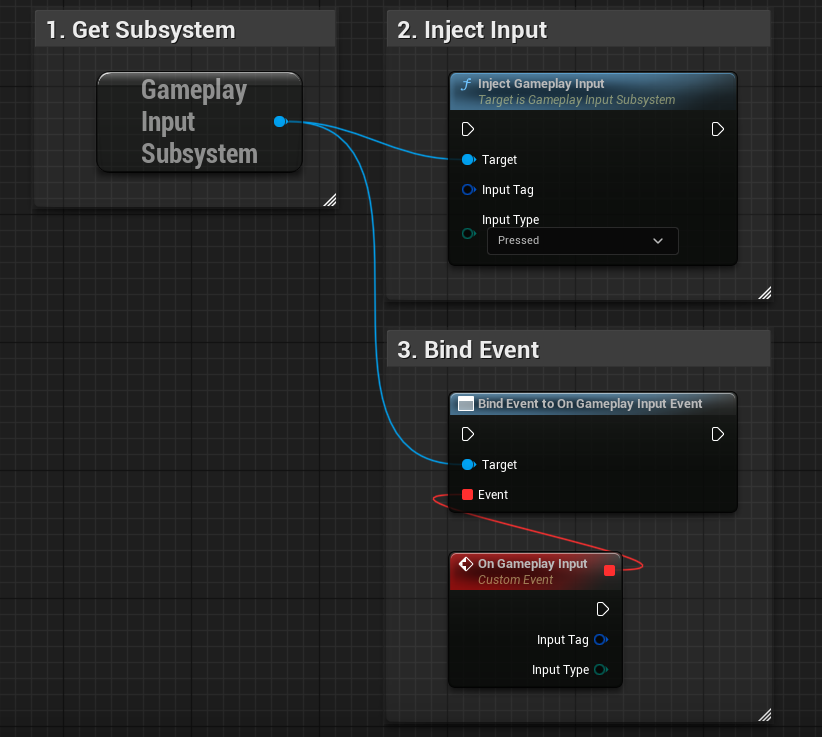
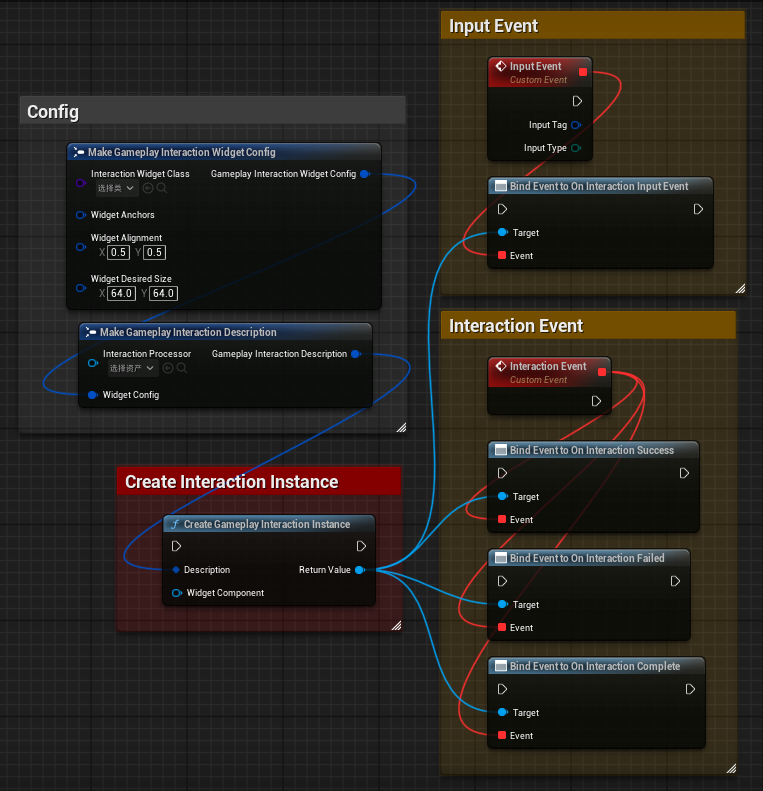
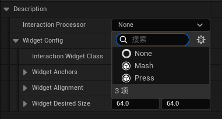
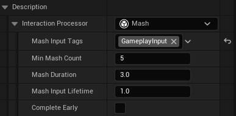
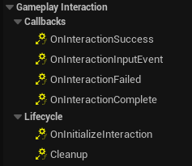
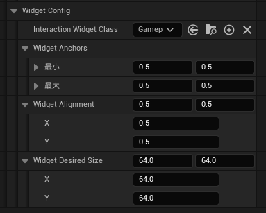
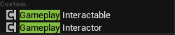
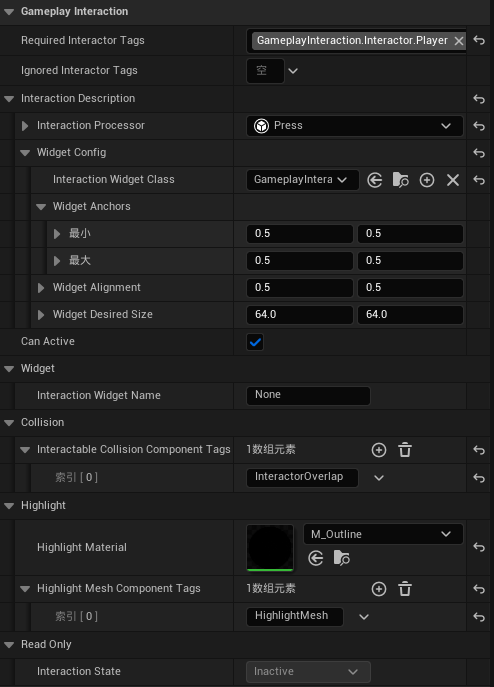
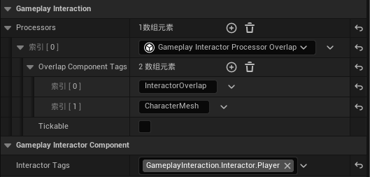
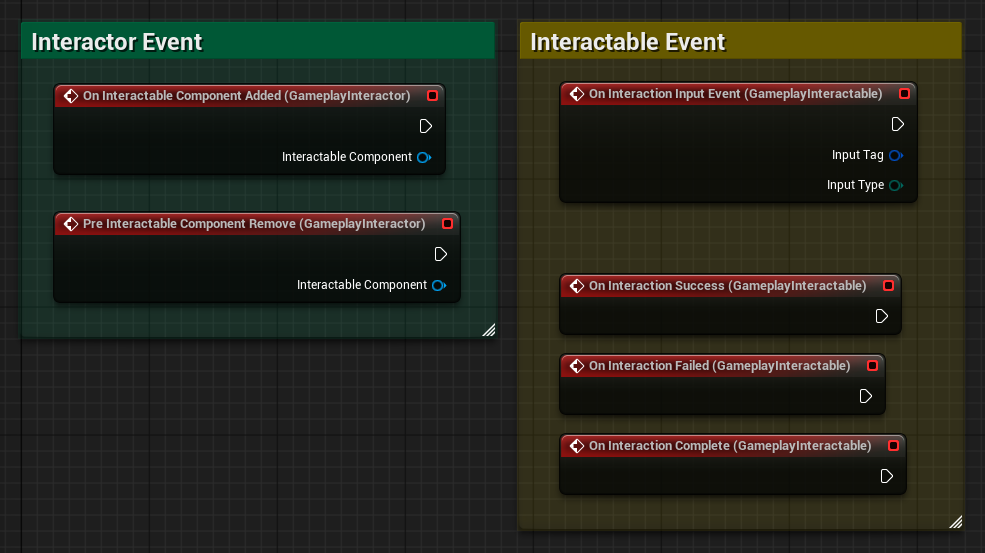

# GameplayInputSystem
> Language: [English](README.md), [中文](README-CN.md)

基于 GameplayTag 的全局输入监听系统，并在此基础上集成了一个交互模块，支持多种自定义交互事件的创建与管理，能同时满足 QTE 输入、NPC 交互等需求，具有高度的扩展性与灵活性。

设计上，本系统专注于游戏逻辑层面的输入事件管理与分发，不直接处理底层硬件输入。开发者可根据项目需求自由选择输入方案，例如 Unreal Engine 默认输入系统或新的 Enhanced Input 系统。  

## 特性
- 基于 GameplayTag 区分输入事件，易于扩展和管理。
- 支持自定义交互事件，适合 QTE 输入、NPC 交互等场景。
- 通过实例化方式创建交互事件，便于动态添加和移除。
- 提供了一个全局的输入监听系统，能够在游戏中统一管理输入事件。
- 兼容 Unreal Engine 的默认输入系统和 Enhanced Input 系统。
- 具有良好的扩展性，用户可以根据需要添加新的输入事件和交互逻辑。

## 插件模块
- **GameplayInputSystem**：全局输入监听系统，提供基础的输入事件管理功能。
- **GameplayInteractionSystem**：基于输入事件的交互系统，支持自定义交互事件的创建和管理。

## 使用说明
### 1. GameplayInputSystem
如果你只需要使用到全局输入监听功能的话，非常简单，甚至一张截图就可以概括所有用法，如下：

具体来说分为三个步骤：
1. **获取GameplayInputSubsystem**：要使用该系统，你只需要关注一个函数和一个事件，他们都在GameplayInputSubsystem中。
2. **注入输入事件**：使用`InjectGameplayInput`函数将输入事件注入到系统中。需要指定输入事件的标签和类型。
3. **监听输入事件**：通过绑定`OnInputEventDispatched`事件来监听输入事件的分发。

一般来说，你应该在对应的输入事件发生时调用`InjectGameplayInput`函数。但有时候你可能需要在其他时机（例如动画事件）手动触发输入事件，这时也可以调用该函数。虽然系统主要是为了处理输入事件，但它也可以用于其他类型的事件，具体根据你的需求来决定。

### 2. GameplayInteractionSystem
#### 2.1 交互实例
如果你需要使用到交互系统，那么首先明确一点，该系统与其他交互系统的主要区别在于它的每一个交互其实都是一个独立的交互实例，因此要创建一次交互，你无需依赖任何组件，只需创建一个`GameplayInteractionInstance`实例即可。以下是使用该系统的概览图，同样非常简单：

一次交互并不代表着一次输入事件的产生，在该系统中，一次交互可以是一段长达3s的长按，也可以是一次精确的点击，甚至可以是一段按键连打、组合键输入等等，这取决于你的配置。但无论如何，对于一次交互来说，必定会产生成功与失败两个结果。成功的交互会触发`OnInteractionSuccess`事件，而失败的交互会触发`OnInteractionFailed`事件。无论成功与否，当交互完成时，`OnInteractionCompleted`事件都会被触发。你可以在创建交互实例之后，绑定这些事件来处理交互结果。

另外，在交互实例激活期间，被该交互实例捕捉到的输入事件也会广播出去，你可以通过监听该实例的`OnInteractionInputEvent`事件来获取这些输入事件。这允许你在交互持续期间对特定的输入事件进行处理。

#### 2.2 交互配置
交互配置是指在创建`GameplayInteractionInstance`实例时，指定该交互的相关参数和行为。主要配置项为InteractionProcessor，它定义了交互的处理逻辑和输入事件的响应方式。你可以通过继承`UGameplayInteractionProcessor`类来实现自定义的交互处理逻辑。

GameplayInteractionProcessor以实例化储存引用，你可以在编辑器中配置Processor的默认值。比如我要配置一个按键连打交互，可以如下配置：

这表示该交互需要在3s内累计接收到5次`GameplayInput`Tag输入事件，且每次输入事件的间隔不能超过1s。
你可以根据需要配置不同的交互处理器，以适应不同的交互需求，你也可以自由拓展自己的交互处理器，以满足特定的游戏需求。未来，我会提供更多的默认交互处理器。

#### 2.3 交互控件
在交互配置中，你可以指定一个交互控件（InteractionWidget），它是一个UI组件，用于在交互过程中向玩家展示相关信息。任何UserWidget，只要实现了`IGameplayInteractionWidgetInterface`接口，就可以作为交互控件使用。

接口提供以下回调：

Callbacks类别的回调函数看名称就一目了然，主要用于在交互过程中更新UI状态，你可以播放一些UI动画，或者更新UI文本等。

而Lifecycle类别的回调函数则用于在交互的不同阶段进行处理，比如在交互开始时显示UI，在交互结束时隐藏UI等。

有了控件类，你就可以将其作为交互配置的一部分，在创建交互实例时传入。此外，你还可以有更多的配置项，如下：

你可以额外的指定控件的锚点位置、对齐方式、所需大小，他们会直接应用到控件上。

默认情况下，在创建交互实例时，若没有指定目标WidgetComponent，系统会直接创建Widget实例并将其添加到玩家的Viewport中。这对于制作QTE效果非常方便，因为你可以快速地在屏幕上显示提示信息。

#### 2.4 交互组件
如果你需要在Actor上使用交互系统，可以使用以下组件，他们可以很方便实现该需求：

- **GameplayInterableComponent**：你可以将该组件添加到任何Actor上，它定义了一个可交互的Actor。
- **GameplayInteractorComponent**：同样，你可以将该组件添加到任何Actor上，它定义了一个交互者。交互者可以是玩家角色、NPC等。它负责触发GameplayInteractableComponent上的交互事件。

##### 2.4.1 GameplayInterableComponent
为Actor添加该组件后，你可以在编辑器中配置该Actor的交互属性，如下：

- **Required Interactor Tags**：指定该Actor所需的交互者标签，只有具有这些标签的交互者才能与该Actor进行交互。
- **Ignored Interactor Tags**：指定该Actor忽略的交互者标签，具有这些标签的交互者将无法与该Actor进行交互。
- **Interaction Description**：指定该Actor的交互描述，与之前创建的交互实例一致，你可以定义交互的处理逻辑和输入事件的响应方式，包括所用的交互控件。
- **Can Active**：定义了该Actor是否可以被激活进行交互，你也可以在运行时动态修改该属性。
- **Interaction Widget Name**：指定交互控件所用的Widget组件名称，该组件应与GameplayInterableComponent处于同一Actor上，系统会在初始化时自动查找并绑定该组件。若未指定或无法找到，则默认将交互控件添加到玩家的Viewport中。
- **Interactable Collision Component Tags**：指定该Actor的交互碰撞组件标签，系统会在运行时查找具有这些标签的碰撞组件，并将其作为交互碰撞组件。你可以创建多个碰撞组件，他们共同作为该Actor的交互区域。
- **Highlight**: 你可以指定一个高亮材质，并指定一到多个需要高亮的模型Tag。系统会在交互开始时将高亮材质作为覆层材质应用到这些模型上。

##### 2.4.2 GameplayInteractorComponent
有了可交互对象后，现在我们来创建一个交互者。你可以将该组件添加到任何Actor上，它定义了一个交互者。交互者可以是玩家角色、NPC等。它负责触发GameplayInteractableComponent上的交互事件。

为Actor添加该组件后，你可以在编辑器中配置该Actor的交互属性，如下：

- **Processor**：交互者处理器与之前的交互处理器完全不同，交互处理器定义的是交互事件的处理逻辑，而交互者处理器只负责处理可交互对象的生命周期。举例来说，你可以定义一个Overlap交互者处理器，他会在交互者与可交互对象发生重叠时自动触发可交互对象的交互事件，而在重叠结束时自动取消交互。又或者，你可以定义一个视锥交互者处理器，他会在交互者进入可交互对象的视锥时自动触发交互事件，而在离开视锥时自动取消交互。你可以同时挂载多个交互者处理器，以实现更复杂的交互逻辑。处理器之间相互独立，他们只负责告诉交互者当前有哪些可交互对象需要激活，哪些需要取消。
- **Interactor Tags**：指定该Actor的交互者标签，交互者标签用于区分不同类型的交互者，比如玩家、NPC等。

为了提高性能，对于交互者处理器，你可以在自定义交互者处理器时，选择是否要使用Tick函数来更新交互状态，Tickable参数决定了该处理器是否需要Tick。

##### 2.4.3 事件回调
两个组件都提供了事件回调，你可以在Actor上绑定这些事件来处理交互逻辑。

## TODO
- [ ] 增加更多的默认交互处理器，比如长按、组合键等。
- [ ] 增加更多的默认交互控件，比如进度条、提示框等。
- [ ] 添加更多的交互者处理器，比如视锥处理器，该处理器将在不久后实现。
- [ ] 评估是否重构GameplayInteractableComponent的生命周期管理，以提供更灵活的交互逻辑。

## 关于PR
如果你对该系统有任何改进建议或想法，欢迎提交PR！我们非常欢迎和感谢社区的参与和贡献。
请确保你的PR遵循以下几点：
1. PR应包含清晰的描述，说明你所做的更改和目的。
2. PR应遵循代码风格和规范，以保持代码的一致性和可读性。
3. PR应包含必要的文档更新，以便其他人能够理解你的更改。

## 许可证
本项目采用MIT许可证，详情请查看[LICENSE](LICENSE)文件。