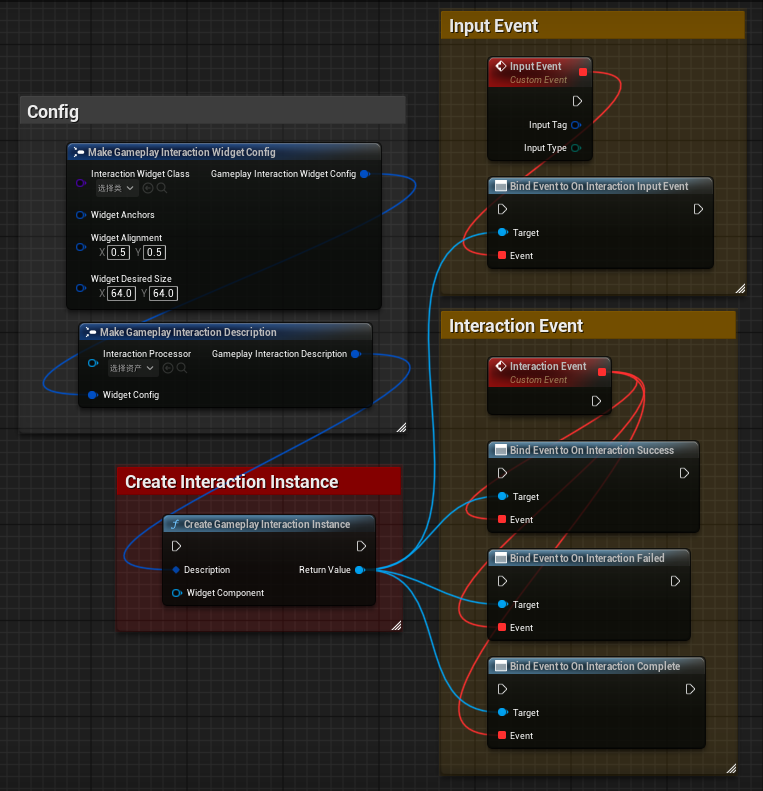
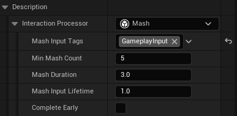
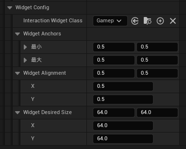
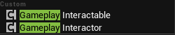

# GameplayInputSystem
> Language: [English](README.md), [中文](README-CN.md)

A global input listening system based on GameplayTag, integrated with an interaction module that supports the creation and management of various custom interaction events. It meets the needs of QTE inputs, NPC interactions, and more, offering high extensibility and flexibility.

This system focuses on managing and dispatching input events at the game logic level and does not directly handle low-level hardware inputs. Developers can freely choose input solutions based on project requirements, such as Unreal Engine's default input system or the new Enhanced Input system.

## Features
- Input events are distinguished by GameplayTags, making them easy to extend and manage.
- Supports custom interaction events, suitable for scenarios like QTE inputs and NPC interactions.
- Interaction events are created through instantiation, allowing for dynamic addition and removal.
- Provides a global input listening system for unified input event management in games.
- Compatible with Unreal Engine's default input system and Enhanced Input system.
- Highly extensible, enabling users to add new input events and interaction logic as needed.

## Plugin Modules
- **GameplayInputSystem**: A global input listening system that provides basic input event management functionality.
- **GameplayInteractionSystem**: An interaction system based on input events, supporting the creation and management of custom interaction events.

## Usage Instructions
### 1. GameplayInputSystem
If you only need the global input listening functionality, it's very simple and can be summarized in one screenshot:

Specifically, it involves three steps:
1. **Obtain the GameplayInputSubsystem**: To use this system, you only need to focus on one function and one event, both of which are in the GameplayInputSubsystem.
2. **Inject Input Events**: Use the `InjectGameplayInput` function to inject input events into the system. You need to specify the tag and type of the input event.
3. **Listen for Input Events**: Bind to the `OnInputEventDispatched` event to listen for the dispatching of input events.

Typically, you should call the `InjectGameplayInput` function when the corresponding input event occurs. However, you might need to manually trigger input events at other times (e.g., during animation events). In such cases, you can also call this function. While the system is primarily designed for handling input events, it can also be used for other types of events, depending on your needs.

### 2. GameplayInteractionSystem
#### 2.1 Interaction Instances
If you need to use the interaction system, note that its main difference from other interaction systems is that each interaction is an independent instance. To create an interaction, you don't need to rely on any components; you only need to create a `GameplayInteractionInstance`. Here's an overview of the system:

An interaction does not necessarily correspond to a single input event. In this system, an interaction can be a 3-second long press, a precise click, or even a sequence of button presses or combo inputs, depending on your configuration. Regardless, every interaction will result in either success or failure. Successful interactions trigger the `OnInteractionSuccess` event, while failed interactions trigger the `OnInteractionFailed` event. When the interaction is completed, the `OnInteractionCompleted` event is triggered regardless of the outcome. You can bind to these events after creating an interaction instance to handle the results.

Additionally, during the activation of an interaction instance, input events captured by the instance will also be broadcast. You can listen to the instance's `OnInteractionInputEvent` event to process these input events. This allows you to handle specific input events during the interaction.

#### 2.2 Interaction Configuration
Interaction configuration refers to specifying the parameters and behavior of an interaction when creating a `GameplayInteractionInstance`. The main configuration item is the InteractionProcessor, which defines the interaction's processing logic and response to input events. You can implement custom interaction processing logic by inheriting from the `UGameplayInteractionProcessor` class.

The GameplayInteractionProcessor is stored as an instantiated reference, and you can configure its default values in the editor. For example, to configure a button-mashing interaction, you can set it up as follows:

This configuration specifies that the interaction requires receiving 5 `GameplayInput` tag input events within 3 seconds, with no more than 1 second between each event.

You can configure different interaction processors to suit various interaction needs, or extend your own processors to meet specific game requirements. More default interaction processors will be provided in the future.

#### 2.3 Interaction Widgets
In the interaction configuration, you can specify an interaction widget (InteractionWidget), which is a UI component used to display relevant information to the player during the interaction. Any UserWidget that implements the `IGameplayInteractionWidgetInterface` interface can be used as an interaction widget.

The interface provides the following callbacks:

The callbacks in the "Callbacks" category are self-explanatory and are mainly used to update the UI state during the interaction. You can play UI animations, update text, etc.

The callbacks in the "Lifecycle" category are used to handle different stages of the interaction, such as showing the UI at the start of the interaction and hiding it at the end.

With the widget class, you can include it as part of the interaction configuration when creating an interaction instance. Additionally, you can configure more options, as shown below:

You can specify the widget's anchor position, alignment, and required size, which will be directly applied to the widget.

By default, if no target WidgetComponent is specified when creating an interaction instance, the system will directly create a Widget instance and add it to the player's viewport. This is very convenient for creating QTE effects, as you can quickly display prompt information on the screen.

#### 2.4 Interaction Components
If you need to use the interaction system on an Actor, you can use the following components to achieve this easily:

- **GameplayInteractableComponent**: Add this component to any Actor to define it as an interactable Actor.
- **GameplayInteractorComponent**: Similarly, add this component to any Actor to define it as an interactor. An interactor can be a player character, NPC, etc. It is responsible for triggering interaction events on the GameplayInteractableComponent.

##### 2.4.1 GameplayInteractableComponent
After adding this component to an Actor, you can configure the Actor's interaction properties in the editor, as shown below:

- **Required Interactor Tags**: Specifies the tags required for an interactor to interact with this Actor.
- **Ignored Interactor Tags**: Specifies the tags of interactors that are ignored and cannot interact with this Actor.
- **Interaction Description**: Specifies the interaction description for this Actor, consistent with the previously created interaction instance. You can define the interaction's processing logic and response to input events, including the interaction widget used.
- **Can Active**: Defines whether this Actor can be activated for interaction. You can dynamically modify this property at runtime.
- **Interaction Widget Name**: Specifies the name of the widget component used for the interaction widget. This component should be on the same Actor as the GameplayInteractableComponent. The system will automatically find and bind this component during initialization. If not specified or not found, the interaction widget will be added to the player's viewport by default.
- **Interactable Collision Component Tags**: Specifies the tags of collision components for interaction. The system will find collision components with these tags at runtime and use them as the interaction collision components. You can create multiple collision components to collectively define the interaction area.
- **Highlight**: You can specify a highlight material and one or more model tags to highlight. The system will apply the highlight material as an overlay to these models at the start of the interaction.

##### 2.4.2 GameplayInteractorComponent
With interactable objects in place, you can now create an interactor. Add this component to any Actor to define it as an interactor. An interactor can be a player character, NPC, etc. It is responsible for triggering interaction events on the GameplayInteractableComponent.

After adding this component to an Actor, you can configure the Actor's interaction properties in the editor, as shown below:

- **Processor**: Interaction processors differ from the previously mentioned interaction processors. Interaction processors define the logic for handling interaction events, while interactor processors handle the lifecycle of interactable objects. For example, you can define an Overlap interactor processor that automatically triggers interaction events when the interactor overlaps with an interactable object and cancels the interaction when the overlap ends. Alternatively, you can define a Cone of Vision interactor processor that triggers interaction events when the interactor enters the cone of vision of an interactable object and cancels the interaction when it leaves. You can attach multiple interactor processors simultaneously to achieve more complex interaction logic. Processors are independent of each other and only inform the interactor which interactable objects need activation or cancellation.
- **Interactor Tags**: Specifies the tags of the interactor Actor. Interactor tags are used to distinguish different types of interactors, such as players, NPCs, etc.

To improve performance, you can choose whether to use the Tick function to update interaction states when customizing interactor processors. The Tickable parameter determines whether the processor requires ticking.

##### 2.4.3 Event Callbacks
Both components provide event callbacks, allowing you to bind these events on the Actor to handle interaction logic.

## TODO
- [ ] Add more default interaction processors, such as long press, combo keys, etc.
- [ ] Add more default interaction widgets, such as progress bars, prompt boxes, etc.
- [ ] Add more interactor processors, such as a cone of vision processor, which will be implemented soon.
- [ ] Evaluate whether to refactor the lifecycle management of the GameplayInteractableComponent to provide more flexible interaction logic.

## About PRs
If you have any suggestions or ideas for improving this system, feel free to submit a PR! We greatly welcome and appreciate community participation and contributions.
Please ensure your PR adheres to the following:
1. The PR should include a clear description explaining the changes made and their purpose.
2. The PR should follow coding styles and conventions to maintain code consistency and readability.
3. The PR should include necessary documentation updates to help others understand your changes.

## License
This project is licensed under the MIT License. For details, please see the [LICENSE](LICENSE) file.